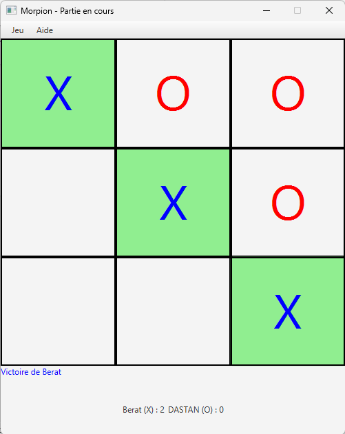
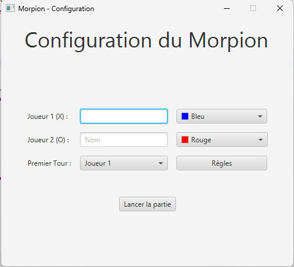
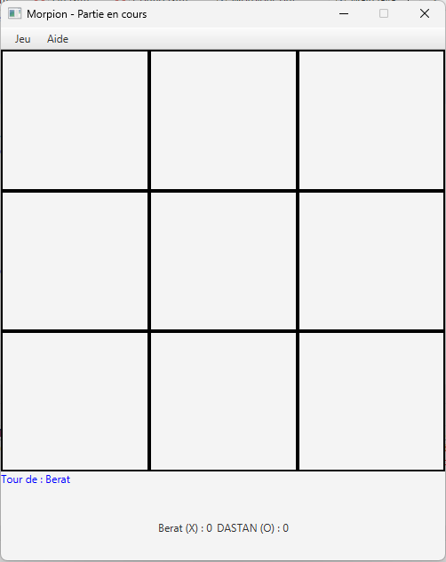
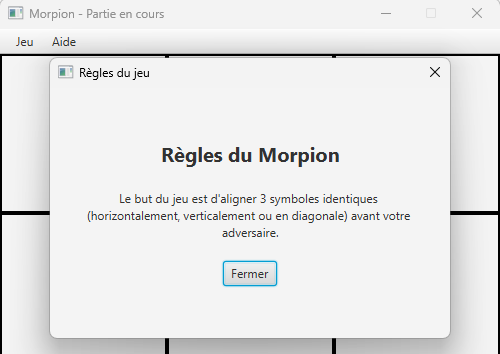
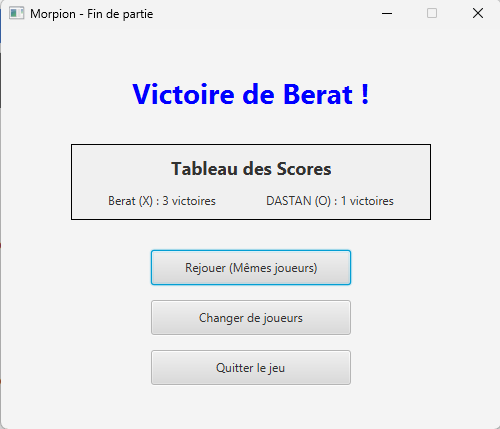

# Morpion


**Un jeu de morpion à deux joueurs, avec personnalisation et suivi des scores.**

J'ai développé cette application de bureau en JavaFX pour travailler la conception d'interfaces avec Scene Builder, la gestion des événements et le passage de données entre plusieurs écrans. Les joueurs choisissent leurs noms, leurs couleurs et qui commence, puis enchaînent les manches sur une grille de 3 × 3 cases.

<p align="center">
  
</p>

## 🛠️ Technologies & outils

- **Langage :** Java 21.
- **Interface graphique :** JavaFX 21, contrôles, scènes et fenêtres modales.
- **Conception des écrans :** Scene Builder et quatre vues FXML.
- **Présentation :** propriétés des composants et styles JavaFX CSS.
- **Environnement d'origine :** Eclipse, avec une bibliothèque JavaFX 21.
- **Compilation et lancement du dépôt :** Maven et Maven Wrapper, ajoutés pour faciliter l'exécution hors de la configuration Eclipse d'origine.

## ✨ Fonctionnalités

- Jouer à deux sur le même ordinateur, chacun son tour, avec les symboles **X** et **O**.
- Personnaliser les noms des joueurs et la couleur de leurs symboles.
- Choisir le premier joueur ou le tirer au sort.
- Afficher le joueur dont c'est le tour et empêcher de jouer dans une case déjà occupée.
- Détecter les victoires sur une ligne, une colonne ou une diagonale, ainsi que les matchs nuls.
- Mettre les trois cases gagnantes en surbrillance avant d'afficher le résultat.
- Consulter les scores et rejouer avec les mêmes joueurs en conservant leurs victoires.
- Changer de joueurs pour revenir à la configuration et remettre les scores à zéro.
- Réinitialiser la grille ou consulter les règles depuis le menu.

## 🖼️ Parcours dans l'application

| Configuration | Plateau de jeu |
| :---: | :---: |
| [](docs/images/configuration.png) | [](docs/images/plateau.png) |

| Règles du jeu | Résultat et scores |
| :---: | :---: |
| [](docs/images/regles.png) | [](docs/images/scores.png) |

*Captures extraites de mon rapport de projet d'origine. Cliquer sur une image pour l'agrandir.*

## 👨‍💻 Mon travail sur ce projet

- Concevoir les **quatre vues FXML** avec Scene Builder et relier leurs composants aux contrôleurs Java.
- Implémenter la **logique de jeu sur une matrice `char[3][3]`**, l'alternance des joueurs et la détection de fin de partie.
- Transmettre les **noms, couleurs et scores entre les contrôleurs** via `FXMLLoader.getController()` et des méthodes d'initialisation.
- Gérer les événements des boutons, la navigation entre scènes et la fenêtre modale des règles.
- Ajouter la surbrillance des cases gagnantes et une pause de **1,5 seconde** avec `PauseTransition` avant l'écran de résultat.

Deux difficultés m'ont particulièrement fait progresser : faire correspondre les `fx:id` aux champs `@FXML`, et transmettre les données au contrôleur suivant avant d'afficher sa scène. La revanche conserve ainsi les joueurs et les scores.

## 🧩 Organisation du code

Les vues FXML sont séparées de leurs contrôleurs. La logique du plateau reste dans `MorpionController` ; il n'y a pas de modèle métier indépendant dans cette version.

```text
src/
├── module-info.java
└── application/
    ├── Main.java                  # Point d'entrée de l'application
    ├── config.fxml                # Noms, couleurs et premier joueur
    ├── ConfigController.java
    ├── morpion.fxml               # Plateau, menus et scores
    ├── MorpionController.java     # Tours, victoires et matchs nuls
    ├── fin.fxml                   # Résultat et choix de la suite
    ├── FinController.java
    ├── regles.fxml                # Fenêtre modale des règles
    ├── ReglesController.java
    └── style.css
```

## 🚀 Essayer le projet

Installer un **JDK 21** et configurer `JAVA_HOME`. Télécharger ou cloner ce dépôt, puis ouvrir un terminal à sa racine. Maven Wrapper télécharge Maven et les dépendances JavaFX au premier lancement ; une connexion Internet est nécessaire à cette étape.

| Action | Windows (PowerShell) | Linux / macOS |
| --- | --- | --- |
| Lancer le jeu | `.\mvnw.cmd javafx:run` | `sh ./mvnw javafx:run` |
| Compiler et créer le JAR | `.\mvnw.cmd clean verify` | `sh ./mvnw clean verify` |

Le JAR dans `target/` ne contient pas JavaFX et n'est pas un exécutable autonome : utiliser la commande de lancement ci-dessus. Pour modifier une vue dans Scene Builder, ouvrir son fichier `.fxml` dans `src/application/`.

**Vérifications de publication :** compilation sous Windows avec Java 21, chargement des quatre FXML et de la ressource CSS depuis le JAR, scénario configuration → victoire → revanche, conservation des scores, huit alignements gagnants et plateau de match nul. Ces contrôles ponctuels ne constituent pas une suite de tests intégrée au dépôt ni une validation sur Linux/macOS.

## 🔧 Limites et pistes d'amélioration

- Le jeu est prévu pour **deux joueurs locaux**, sur une grille fixe de 3 × 3 : aucun adversaire informatique ni mode réseau.
- Les scores sont conservés pendant la session, sans sauvegarde après fermeture.
- La réinitialisation depuis le menu fait commencer X ; une revanche tire le premier joueur au sort.
- Isoler la logique du jeu dans un modèle indépendant faciliterait l'ajout de tests automatisés et de variantes.

## 📋 Contexte et documents

Projet individuel réalisé en première année de BUT Informatique à l'IUT de Laval. L'objectif était de construire un jeu à plusieurs écrans, avec gestion des événements, personnalisation des joueurs et tableau de scores.

<details>
<summary>📄 Consulter le sujet du projet</summary>

[Sujet d'origine — PDF](docs/sujet.pdf). Les variantes proposées dans le sujet, comme l'adversaire informatique et les grilles de taille variable, ne sont pas implémentées dans cette version.

</details>

<details>
<summary>📦 Adaptations pour la publication</summary>

Le contenu des fichiers Java, FXML et CSS du ZIP est conservé. Les adaptations concernent l'organisation et le lancement :

- Les quatre fichiers FXML ont été renommés en minuscules pour correspondre aux chemins utilisés par le code, notamment dans un JAR où la casse compte.
- `application.css` a été renommé en `style.css`, le nom référencé par la vue de configuration.
- `pom.xml`, Maven Wrapper, `.gitignore` et `.gitattributes` ont été ajoutés, ainsi que ce README, le sujet et les captures du rapport.
- Les fichiers compilés et la configuration spécifique à Eclipse sont exclus du dépôt. Le rapport complet n'est pas publié.

La configuration Maven et les commandes de lancement ont été préparées pour GitHub ; elles n'étaient pas dans le ZIP d'origine.

</details>

**Berat Dastan**
